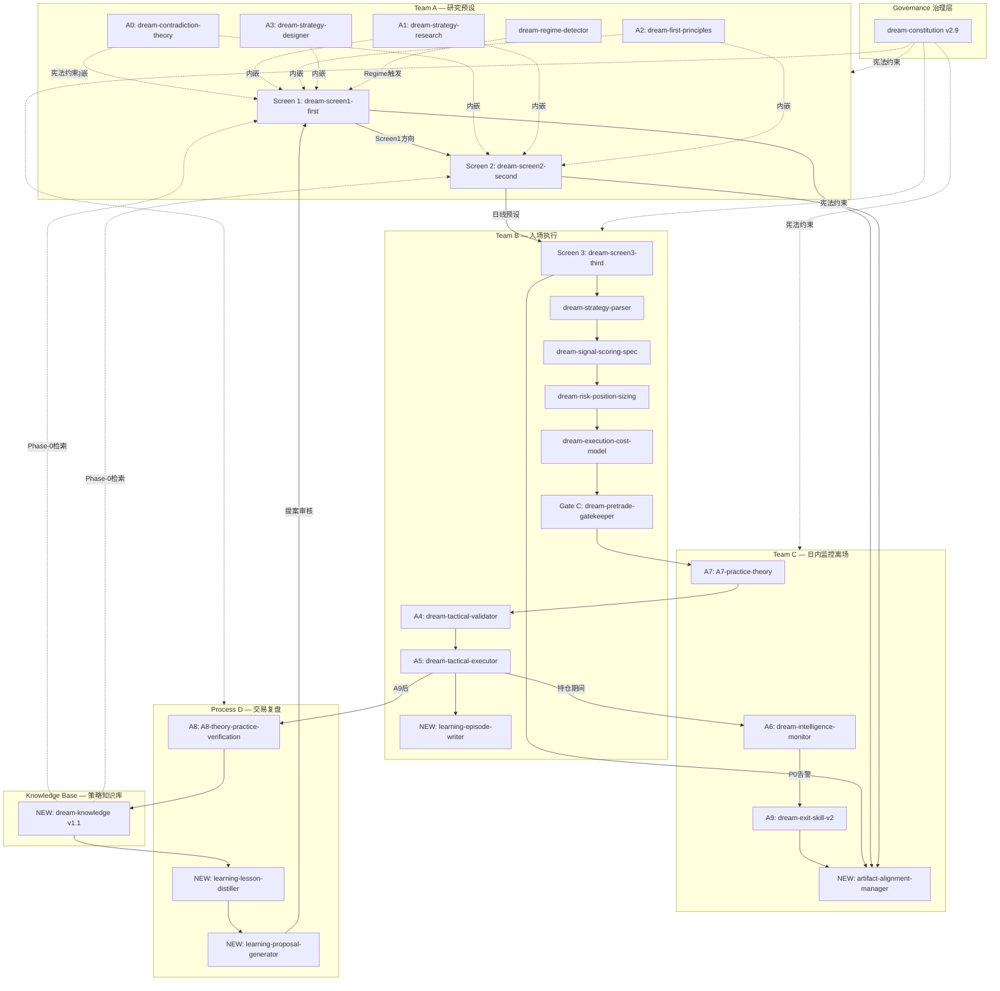

# 6-TRADING SKILL Registry v1.0

> **版本**: v1.0 | **更新日期**: 2026-05-26
> **管理原则**: 所有执行均须符合治理基础层（dream-constitution v2.9）约束。
> **来源说明**: 1-TRADE / 0-CORE = dream-multiskill-v2 | 6-TRADING = 本仓库

---

## 一、架构总览（Mermaid）



---

## 二、5 大团队 SKILL 注册表

### Governance — 治理基础层

| ID | SKILL | 来源 | 版本 | 核心功能 |
|----|-------|------|------|---------|
| G1 | dream-constitution | 0-CORE | v2.9 | 所有决策宪法约束；Chapter2/4/14 映射交易链 |

所有触发提示词须前置引用；Chapter 14 H001-H009 为 Gate C 硬门禁基础。
集成规范: [CONSTITUTION_COMPLIANCE.md](CONSTITUTION_COMPLIANCE.md)

---

### Team A — 研究预设（7个）

**职责**: Screen 1 周线方向 + Screen 2 日线马丁格预设。**纯研究，不执行订单。**
**Phase-0 强制**: Tavily 6 查询 + knowledge 检索，数据不到位则 HARD BLOCK。

| ID | SKILL | 来源 | 阶段 | 核心功能 | 触发时机 |
|----|-------|------|------|---------|---------|
| A1 | dream-screen1-first | 6-TRADING | Screen 1 | 并行编排 A0+A1+A2+A3，输出周线方向+策略类型 | 每周日 20:00 |
| A2 | dream-screen2-second | 6-TRADING | Screen 2 | 顺序 A1→A2→马丁格计算，输出日线预设+情景网格 | 每工作日 07:30 |
| A3 | dream-contradiction-theory | 1-TRADE | A0 | 矛盾论 OS（C1-C8 矛盾发现，4维评分定主矛盾） | 嵌入 A1/A2/A3 内 |
| A4 | dream-strategy-research | 1-TRADE | A1 | 深度调研（五角形准则 + Tavily Phase-0） | Screen 1/2 A1 步骤 |
| A5 | dream-first-principles | 1-TRADE | A2 | 第一性原理（L1/L2/L3 资金流 + 趋势阶段） | Screen 1/2 A2 步骤 |
| A6 | dream-strategy-designer | 1-TRADE | A3 | 多情景战略合成（S1/S2/S3 概率+工具） | Screen 1 A3 步骤 |
| A7 | dream-regime-detector | 1-TRADE | 支持 | 市场状态 7 分类，Master Fit 下降触发蒸馏 | Phase-0 + A6 联动 |

---

### Team B — 入场执行（9个）

**职责**: 读取 Screen 2 预设，执行完整入场链。Gate C BLOCK 不可绕过。
**硬约束**: A5 后无论 ENTER/SKIP 均必须调用 B9 写 episode。

| ID | SKILL | 来源 | 阶段 | 核心功能 | 触发时机 |
|----|-------|------|------|---------|---------|
| B1 | dream-screen3-third | 6-TRADING | Screen 3 | 编排器：Screen 2 presets → 完整执行链 | 每工作日 09:00 |
| B2 | dream-strategy-parser | 1-TRADE | Pre-A4 | Regime→策略路由，输出 directive_bias | Step 0 |
| B3 | dream-signal-scoring-spec | 1-TRADE | 评分 | 8 维评分（trend/macro/onchain/ETF/memory/strategy/geo/pred） | 评分步骤 |
| B4 | dream-risk-position-sizing | 1-TRADE | 风控 | 风险预算仓位，ATR 止损，单笔上限 150 USDT | 仓位步骤 |
| B5 | dream-execution-cost-model | 1-TRADE | 费用 | 费率+滑点估算，atomic_bracket 校验 | 成本步骤 |
| B6 | dream-pretrade-gatekeeper | 1-TRADE | Gate C | H001-H009 硬门禁，最终 PASS/SKIP 裁决 | Gate C |
| B7 | dream-tactical-validator | 1-TRADE | A4 | Demo 账户 3 层索引验证 | A4 步骤 |
| B8 | dream-tactical-executor | 1-TRADE | A5 | 实盘执行（A7 门禁 + RM 顾问否决） | A5 步骤 |
| **B9** | **learning-episode-writer** | **0-CORE** | **执行记录** | **结构化 episode，P006 梦游检测（SKIP≥7 告警）** | **A5 完成后** |

集成规范: [skills/0-core-integration/episode-writer/INTEGRATION.md](../skills/0-core-integration/episode-writer/INTEGRATION.md)

---

### Team C — 日内监控离场（4个）

**职责**: 持仓期间高频监控、实践门禁、离场决策、产物标准化归档。
**说明**: 「持仓存活层」，不负责建仓，负责守仓和离场。

| ID | SKILL | 来源 | 阶段 | 核心功能 | 触发时机 |
|----|-------|------|------|---------|---------|
| C1 | dream-intelligence-monitor | 1-TRADE | A6 | 每小时监控，P0/P1 告警，触发 A1→A3 重启 | 持仓每小时 |
| C2 | A7-practice-theory | 1-TRADE | A7 | 5 项实践门禁（INDEPENDENT_AUTO，读近 4h episode） | A4/A5 前 |
| C3 | dream-exit-skill-v2 | 1-TRADE | A9 | 4 层离场链（TP/SL / 风险事件 / A6 联动 / 强制审计） | A6 告警 + 定时 |
| **C4** | **artifact-alignment-manager** | **0-CORE** | **产物** | **A-series 产物标准化投递，双渠道归档** | **各 Screen 完成后 + A9 后** |

集成规范: [skills/0-core-integration/artifact-alignment/INTEGRATION.md](../skills/0-core-integration/artifact-alignment/INTEGRATION.md)

---

### Process D — 交易复盘（3个）

**职责**: 每周复盘，A8 批评，串联三级学习闭环（knowledge→distill→propose）。

| ID | SKILL | 来源 | 阶段 | 核心功能 | 触发时机 |
|----|-------|------|------|---------|---------|
| D1 | A8-theory-practice-verification | 1-TRADE | A8 | 知行合一批评，纸上谈兵检测，7 步采纳周期 | 每周一 06:00 Step1 |
| **D2** | **learning-lesson-distiller** | **0-CORE** | **规律提炼** | **episodes→lessons（min_freq=3，防噪声过拟合）** | **A8 后 Step3** |
| **D3** | **learning-proposal-generator** | **0-CORE** | **改进提案** | **lessons→proposals（rollback_plan + evidence_refs）** | **D2 后 Step4** |

集成规范: [skills/0-core-integration/lesson-distiller/](../skills/0-core-integration/lesson-distiller/INTEGRATION.md) | [proposal-generator/](../skills/0-core-integration/proposal-generator/INTEGRATION.md)

---

### Knowledge Base — 策略知识库（1个）

**职责**: 沉淀历史策略经验，为 Screen 1/2 Phase-0 提供可检索知识支撑。

| ID | SKILL | 来源 | 版本 | 核心功能 | 存储路径 |
|----|-------|------|------|---------|---------|
| **K1** | **dream-knowledge** | **0-CORE** | **v1.1** | **策略知识库（regime/classic/master），100 分评分体系** | **[knowledge/](../knowledge/)** |

集成规范: [skills/0-core-integration/knowledge/INTEGRATION.md](../skills/0-core-integration/knowledge/INTEGRATION.md)

---

## 三、完整执行时序

```
每周日 20:00   Team A Screen 1
  Phase-0: Tavily 6查询 + knowledge检索
  -> A0矛盾论 + A1调研 + A2第一性原理 + A3战略 [并行]
  -> C4 产物归档 -> 更新记忆

每工作日 07:30 Team A Screen 2
  Phase-0: 价格漂移检查 + Tavily日线
  -> A1->A2->马丁格计算 [顺序]
  -> C4 产物归档 -> 更新记忆

每工作日 09:00 Team B Screen 3
  Step0: B2 Regime路由
  -> B3评分 + B4仓位 + B5成本 [并行]
  -> C2 A7门禁 -> B6 Gate C -> B7 A4验证 -> B8 A5执行
  -> B9 episode-writer [ENTER/SKIP 均写]
  -> C4 产物归档

持仓期间每小时 Team C
  C1 A6监控 -> P0告警 -> C3 A9离场 -> C4产物归档

每周一 06:00   Process D 复盘
  D1 A8批评 -> K1知识库写入 -> D2提炼lessons -> D3生成proposals
  -> 输出 a8-reflection + weekly-lessons + weekly-proposals -> 更新记忆
```

---

## 四、新增 SKILL 集成索引

| SKILL | 团队 | INTEGRATION.md |
|-------|------|----------------|
| dream-constitution | Governance | [CONSTITUTION_COMPLIANCE.md](CONSTITUTION_COMPLIANCE.md) |
| artifact-alignment-manager | Team C (C4) | [skills/0-core-integration/artifact-alignment/](../skills/0-core-integration/artifact-alignment/INTEGRATION.md) |
| learning-episode-writer | Team B (B9) | [skills/0-core-integration/episode-writer/](../skills/0-core-integration/episode-writer/INTEGRATION.md) |
| dream-knowledge | Knowledge Base (K1) | [skills/0-core-integration/knowledge/](../skills/0-core-integration/knowledge/INTEGRATION.md) |
| learning-lesson-distiller | Process D (D2) | [skills/0-core-integration/lesson-distiller/](../skills/0-core-integration/lesson-distiller/INTEGRATION.md) |
| learning-proposal-generator | Process D (D3) | [skills/0-core-integration/proposal-generator/](../skills/0-core-integration/proposal-generator/INTEGRATION.md) |

---

*最后更新: 2026-05-26 | 维护者: 6-TRADING Claude Code 协作系统*
