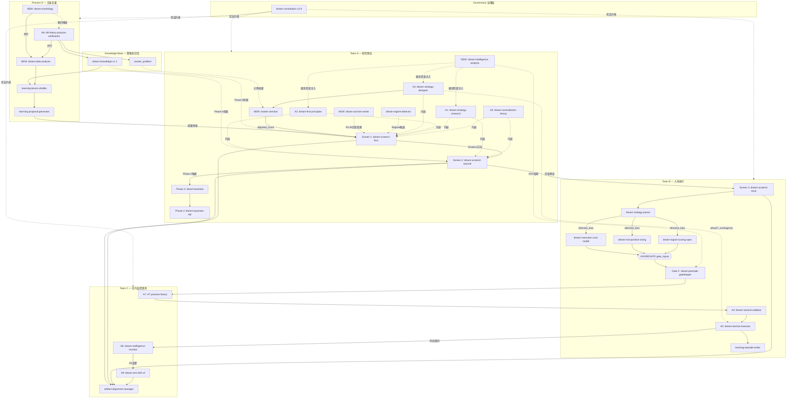

# 6-TRADING SKILL Registry v1.2

> **版本**: v1.2 | **更新日期**: 2026-05-26
> **管理原则**: 所有执行均须符合治理基础层（dream-constitution v2.9）约束。
> **来源说明**: 1-TRADE / 0-CORE / 2-INTEL = dream-multiskill-v2 | 6-TRADING = 本仓库
> **v1.1**: G1-G6 缺口修复（dream-backtest/bayesian-opt / B3/B4/B5 并行合约 / phase7_contingency）
> **v1.2**: 集成 5 个 2-INTELLIGENCE SKILL（dream-data-analysis/intelligence-analysis/master-seminar/archive-center/dream-oneirology）

---

## 一、架构总览（Mermaid）



---

## 二、5 大团队 SKILL 注册表

### Governance — 治理基础层

| ID | SKILL | 来源 | 版本 | 核心功能 |
|----|-------|------|------|---------|
| G1 | dream-constitution | 0-CORE | v2.9 | 所有决策宪法约束；Chapter2/4/14 映射交易链 |

集成规范: [CONSTITUTION_COMPLIANCE.md](CONSTITUTION_COMPLIANCE.md)

---

### Team A — 研究预设（12个）

**职责**: Screen 1 周线方向 + Screen 2 日线马丁格预设。**纯研究，不执行订单。**
**Phase-0 强制**: Tavily 6 查询 + P0.4b历史情景 + knowledge 检索，数据不到位则 HARD BLOCK。
**Screen 2 执行顺序**: Phase-1 分析 → Phase-2 backtest/bayesian-opt → Phase-3 输出。

| ID | SKILL | 来源 | 阶段 | 核心功能 | 触发时机 |
|----|-------|------|------|---------|---------|
| A1 | dream-screen1-first | 6-TRADING | Screen 1 | 编排 A0+A1+A2+A3 + IA偏见检查 + AC历史情景 + MS大师辩论 | 每周日 20:00 |
| A2 | dream-screen2-second | 6-TRADING | Screen 2 | A1→A2→马丁格→Phase-2验证→输出日线预设 | 每工作日 07:30 |
| A3 | dream-contradiction-theory | 1-TRADE | A0 | 矛盾论 OS（C1-C8，4维评分定主矛盾）| 嵌入内部 |
| A4 | dream-strategy-research | 1-TRADE | A1 | 深度调研 + **IA-A1 锚定/可得性偏见检查** | Screen 1/2 A1 |
| A5 | dream-first-principles | 1-TRADE | A2 | 第一性原理 + **IA-A2 确认/过度自信偏见检查** | Screen 1/2 A2 |
| A6 | dream-strategy-designer | 1-TRADE | A3 | 多情景合成（S1/S2/S3）+ **IA-A3 红队分析** + **phase7_contingency 输出** | Screen 1 A3 |
| A7 | dream-regime-detector | 1-TRADE | 支持 | 市场状态 7 分类，Master Fit 下降触发蒸馏 | Phase-0 + A6 |
| A8s | dream-backtest | 1-TRADE | Screen 2 Phase-2 | 历史回测验证 martingale 参数；失败则降级 `phase2_skipped:true` | A1→A2→A3 后 |
| A9s | dream-bayesian-opt | 1-TRADE | Screen 2 Phase-2 | 贝叶斯优化马丁格参数；依赖 A8s backtest_result | A8s 后 |
| **AC** | **dream-archive-center** | **2-INTEL** | **Phase-0 P0.4b** | **Tavily 历史类比情景检索（非HARD BLOCK）；输出 historical_analogues 注入 data_context** | **P0.4 完成后** |
| **IA** | **dream-intelligence-analysis** | **2-INTEL** | **注入（A1/A2/A3/GC/A8）** | **CIA 认知偏见检查（7大偏见）+ ACH 竞争性假设 + 红队分析；纯提示词注入** | **各 Agent 执行时** |
| **MS** | **master-seminar** | **2-INTEL** | **Screen 1 A3 后** | **多空阵营大师辩论（4大师/6强化），输出 master-debate.json + screen1_score 调整 ±15** | **A6 完成后** |

集成规范:
- AC: [skills/2-intelligence-integration/archive-center/](../skills/2-intelligence-integration/archive-center/INTEGRATION.md)
- IA: [skills/2-intelligence-integration/intelligence-analysis/](../skills/2-intelligence-integration/intelligence-analysis/INTEGRATION.md)
- MS: [skills/2-intelligence-integration/master-seminar/](../skills/2-intelligence-integration/master-seminar/INTEGRATION.md)

---

### Team B — 入场执行（9个）

**职责**: 读取 Screen 2 预设，执行完整入场链。Gate C BLOCK 不可绕过。
**硬约束**: A5 后无论 ENTER/SKIP 均必须调用 B9 写 episode。
**并行合约**: B3/B4/B5 必须并行完成后聚合，三合一才触发 B6。

| ID | SKILL | 来源 | 阶段 | 核心功能 | 触发时机 |
|----|-------|------|------|---------|---------|
| B1 | dream-screen3-third | 6-TRADING | Screen 3 | 编排器 | 每工作日 09:00 |
| B2 | dream-strategy-parser | 1-TRADE | Step 0 | Regime→策略路由；输出 directive_bias | B1 后 |
| B3 | dream-signal-scoring-spec | 1-TRADE | 评分 [并行] | 8 维评分；输出 scores_result | B2 后，与 B4/B5 并行 |
| B4 | dream-risk-position-sizing | 1-TRADE | 风控 [并行] | 风险预算仓位；输出 position_result | B2 后，与 B3/B5 并行 |
| B5 | dream-execution-cost-model | 1-TRADE | 费用 [并行] | 费率+滑点；输出 execution_cost_result | B2 后，与 B3/B4 并行 |
| B6 | dream-pretrade-gatekeeper | 1-TRADE | Gate C | H001-H009 + **IA-GC ACH 矩阵验证**；三合一入参 | B3+B4+B5 全部后 |
| B7 | dream-tactical-validator | 1-TRADE | A4 | Demo 账户 3 层索引验证 | A4 步骤 |
| B8 | dream-tactical-executor | 1-TRADE | A5 | 读 phase7_contingency；实盘执行 | A5 步骤 |
| B9 | learning-episode-writer | 0-CORE | 执行记录 | 结构化 episode；P006 梦游检测（SKIP≥7）| A5 后 |

集成规范: [skills/0-core-integration/episode-writer/](../skills/0-core-integration/episode-writer/INTEGRATION.md)

---

### Team C — 日内监控离场（4个）

| ID | SKILL | 来源 | 阶段 | 核心功能 | 触发时机 |
|----|-------|------|------|---------|---------|
| C1 | dream-intelligence-monitor | 1-TRADE | A6 | 每小时监控，P0/P1 告警 | 持仓每小时 |
| C2 | A7-practice-theory | 1-TRADE | A7 | 5 项实践门禁 | A4/A5 前 |
| C3 | dream-exit-skill-v2 | 1-TRADE | A9 | 4 层离场链 | A6 告警 + 定时 |
| C4 | artifact-alignment-manager | 0-CORE | 产物 | A-series 产物标准化归档 | 各 Screen 完成后 + A9 后 |

集成规范: [skills/0-core-integration/artifact-alignment/](../skills/0-core-integration/artifact-alignment/INTEGRATION.md)

---

### Process D — 交易复盘（5个）

**职责**: 每周复盘，OE+A8 并行分析，DA 量化分析，串联三级学习闭环。

| ID | SKILL | 来源 | 阶段 | 核心功能 | 触发时机 |
|----|-------|------|------|---------|---------|
| D1 | A8-theory-practice-verification | 1-TRADE | A8 | 知行合一批评 + **IA-PD 偏见审计** + 大师动态进化 | 每周一 06:00 Step 1 |
| **DA** | **dream-data-analysis** | **2-INTEL** | **Step 1.5** | **episodes 时序分析（趋势/阻力/置信度趋势）；输出 calibration_suggestions 供 D3** | **A8 后、D2 前** |
| D2 | learning-lesson-distiller | 0-CORE | Step 3 | episodes→lessons（min_freq=3）；**读 DA 量化报告作为证据** | DA 后 |
| D3 | learning-proposal-generator | 0-CORE | Step 4 | lessons→proposals（rollback_plan + evidence_refs）| D2 后 |
| **OE** | **dream-oneirology** | **2-INTEL** | **Step 0 并行** | **弗洛伊德梦分析：强迫性重复/维度凝缩/被压制判断；顾问输出，无 Gate 权力** | **与 A8 并行** |

集成规范:
- DA: [skills/2-intelligence-integration/data-analysis/](../skills/2-intelligence-integration/data-analysis/INTEGRATION.md)
- OE: [skills/2-intelligence-integration/oneirology/](../skills/2-intelligence-integration/oneirology/INTEGRATION.md)

---

### Knowledge Base — 策略知识库（1个 + master_profiles）

| ID | SKILL | 来源 | 版本 | 核心功能 | 存储路径 |
|----|-------|------|------|---------|---------|
| K1 | dream-knowledge | 0-CORE | v1.1 | 策略知识库（regime/classic/master），100 分评分体系 | [knowledge/](../knowledge/) |
| MP | — | — | — | 大师档案库（master-seminar 专用，Process D 动态进化）| [knowledge/master_profiles/](../knowledge/master_profiles/) |

集成规范: [skills/0-core-integration/knowledge/](../skills/0-core-integration/knowledge/INTEGRATION.md)

---

## 三、完整执行时序（v1.2）

```
每周日 20:00   Team A Screen 1        [CronCreate: b9ce16da]
  Phase-0:
    P0.1-P0.6: Tavily 6 查询（HARD BLOCK 步骤）
    P0.4b: dream-archive-center 历史情景检索（非 HARD BLOCK）
    P0.7: 价格可信度验证
    P0.8: 合并 data_context（含 historical_analogues）
  Phase-1:
    并行启动 3 子 Agent（均注入 IA 认知偏见检查）：
      A1 (调研 + IA-A1 锚定/可得性检查)
      A2 (第一性原理 + IA-A2 确认/过度自信检查)
      A3 (沙盘推演 + IA-A3 红队分析 → red_team_flag)
    A3 完成后 → master-seminar 大师辩论 → adjusted screen1_score
    输出: strategy-type.json (含 red_team_flag, phase7_contingency)
          weekly-direction.md + master-debate.json
  → C4 产物归档 → 更新记忆

每工作日 07:30 Team A Screen 2        [CronCreate: cd7edd91]
  Phase-0: 价格漂移检查 + Tavily 日线 + knowledge 检索
  Phase-1: A1→A2→马丁格计算 [顺序]
  Phase-2: dream-backtest (DA 趋势上下文注入) → dream-bayesian-opt [顺序]
           失败则 phase2_skipped=true
  Phase-3: 合并输出 daily-presets.json + martingale-grid.json
  → C4 产物归档 → 更新记忆

每工作日 09:00 Team B Screen 3        [CronCreate: a30b1027]
  Step 0: B2 Regime 路由 → directive_bias
  → B3 评分 + B4 仓位 + B5 成本 [并行，全部完成才继续]
  → AGGREGATE(scores+position+cost)
  → C2 A7 门禁 → B6 Gate C (IA-GC ACH 验证)
  → B7 A4 验证 → B8 A5 执行（读 phase7_contingency）
  → B9 episode-writer [ENTER/SKIP 均写]
  → C4 产物归档

持仓期间每小时 Team C
  C1 A6 监控 → P0 告警 → C3 A9 离场 → C4 产物归档

每周一 06:00   Process D 复盘        [CronCreate: 21514de4]
  Step 0 [并行]:
    A) D1 A8 批评 (含 IA-PD 偏见审计)
    B) OE dream-oneirology (强迫重复/维度凝缩/被压制判断)
  Step 1.5: DA dream-data-analysis (episodes 量化分析 → calibration_suggestions)
  Step 2: K1 知识库写入 (Screen1 结论 + A9 离场结果)
  Step 3: D2 lesson-distiller (episodes + DA量化报告 → lessons_delta)
  Step 4: D3 proposal-generator (lessons → proposals，含 rollback_plan)
  Step 5: C4 产物归档
  Step 6: 更新记忆 project_trading_session_state.md
  Step 3.5 (D1后): master-seminar 大师动态进化 (调整 historical_accuracy 权重)
```

---

## 四、数据流合约摘要（跨团队接口）

| 接口 | 生产者 | 消费者 | 文件路径 |
|------|-------|-------|---------|
| screen1_direction | A1 | A2, B1, B6(H001) | memory/project_trading_session_state.md |
| daily-presets | A2 | B1 | sessions/{id}/team-a/screen2/daily-presets.json |
| phase7_contingency | A6 | B8 | sessions/{id}/team-a/screen1/strategy-type.json |
| historical_analogues | AC (P0.4b) | A1/A2/A3 | data_context 内存字段 |
| red_team_flag | IA-A3 | MS, Gate C | sessions/{id}/team-a/screen1/strategy-type.json |
| master-debate.json | MS | A8 大师进化 | sessions/{id}/team-a/screen1/master-debate.json |
| scores_result | B3 [并行] | B6 | 内存 |
| position_result | B4 [并行] | B6 | 内存 |
| execution_cost_result | B5 [并行] | B6 | 内存 |
| ach_summary | IA-GC | B6 | sessions/{id}/gate-c/pretrade-check.json |
| a7_gate_result | B8→a7-gate.json | B9 | sessions/{id}/team-b/a7-gate.json |
| episode.json | B9 | D2, DA, OE | sessions/{id}/team-b/episode.json |
| data-analysis-report | DA | D2, D3 | sessions/{id}/review/data-analysis-report.json |
| oneirology-report | OE | D1, D3 | sessions/{id}/review/oneirology-report.json |
| bias_audit | IA-PD | D3 | sessions/{id}/review/a8-reflection.json |
| weekly-lessons | D2 | D3 | sessions/{id}/review/weekly-lessons.json |
| weekly-proposals | D3 | 人工审核 | sessions/{id}/review/weekly-proposals.json |

---

## 五、SKILL 集成索引（完整）

| SKILL | 团队 | 来源 | INTEGRATION.md |
|-------|------|------|----------------|
| dream-constitution | Governance | 0-CORE | [CONSTITUTION_COMPLIANCE.md](CONSTITUTION_COMPLIANCE.md) |
| dream-backtest | Team A (A8s) | 1-TRADE | dream-multiskill-v2/1-TRADE |
| dream-bayesian-opt | Team A (A9s) | 1-TRADE | dream-multiskill-v2/1-TRADE |
| **dream-archive-center** | **Team A (AC)** | **2-INTEL** | [2-intelligence-integration/archive-center/](../skills/2-intelligence-integration/archive-center/INTEGRATION.md) |
| **dream-intelligence-analysis** | **Team A+GC+PD (IA)** | **2-INTEL** | [2-intelligence-integration/intelligence-analysis/](../skills/2-intelligence-integration/intelligence-analysis/INTEGRATION.md) |
| **master-seminar** | **Team A (MS)** | **2-INTEL** | [2-intelligence-integration/master-seminar/](../skills/2-intelligence-integration/master-seminar/INTEGRATION.md) |
| artifact-alignment-manager | Team C (C4) | 0-CORE | [0-core-integration/artifact-alignment/](../skills/0-core-integration/artifact-alignment/INTEGRATION.md) |
| learning-episode-writer | Team B (B9) | 0-CORE | [0-core-integration/episode-writer/](../skills/0-core-integration/episode-writer/INTEGRATION.md) |
| dream-knowledge | Knowledge Base (K1) | 0-CORE | [0-core-integration/knowledge/](../skills/0-core-integration/knowledge/INTEGRATION.md) |
| learning-lesson-distiller | Process D (D2) | 0-CORE | [0-core-integration/lesson-distiller/](../skills/0-core-integration/lesson-distiller/INTEGRATION.md) |
| learning-proposal-generator | Process D (D3) | 0-CORE | [0-core-integration/proposal-generator/](../skills/0-core-integration/proposal-generator/INTEGRATION.md) |
| **dream-data-analysis** | **Process D (DA)** | **2-INTEL** | [2-intelligence-integration/data-analysis/](../skills/2-intelligence-integration/data-analysis/INTEGRATION.md) |
| **dream-oneirology** | **Process D (OE)** | **2-INTEL** | [2-intelligence-integration/oneirology/](../skills/2-intelligence-integration/oneirology/INTEGRATION.md) |

---

*最后更新: 2026-05-26 v1.2 | 集成 2-INTELLIGENCE 5个 SKILL | 维护者: 6-TRADING Claude Code 协作系统*
