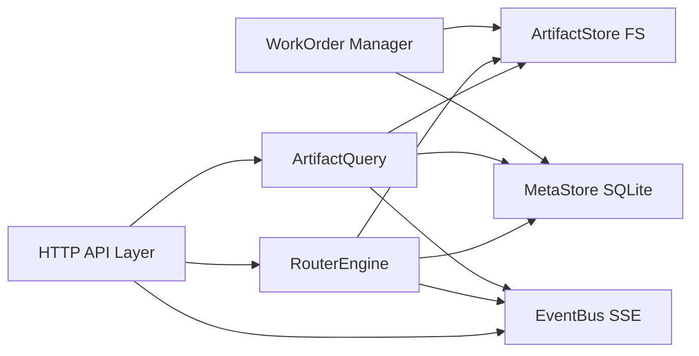

# 7-ARTIFACT-HUB-V2（产物中台与路由服务）架构设计

> 仓库：`/Users/zhangjiangtao/WorkBuddy/dreambuddy-v1`  
> 版本：v0（Design）  
> 日期：2026-05-15  
> 目标：落地第 2 层“产物中台与路由（AI 治理端）”服务，支持节点级可视化 DAG、可追溯审计、对外稳定 API；生产端采用文件系统 tasks/results 协议对接 WorkBuddy。

## 0. 范围与非目标

### 范围
- 构建一个 Node.js/TypeScript “中台服务”（7-ARTIFACT-HUB-V2），提供：
  - 产物统一扫描、索引、检索、读取
  - 路由决策与节点级 DAG 输出（可视化与回放的最小数据闭环）
  - 事件流（SSE）与审计存储（SQLite）
  - Work order 管理（写入 tasks/，消费 results/）
- 数据落盘全部在 `dreambuddy-v1` 仓库目录内，不依赖 `~/.workbuddy`。

### 非目标
- 不做历史文件迁移（只做功能迁移与新链路落地）
- 不要求 WorkBuddy 暴露 HTTP API（第一版只用文件系统协议）
- 不实现治理端 UI（只提供中台服务 API + 事件，后续 UI 可对接）

## 1. 设计原则

- 单一真相源（FS）：产物文件的真相源为仓库内 `dreambuddy/artifacts`。
- 元数据强索引（SQLite）：所有可视化/审计/路由决策需要可查询、可回放的结构化存储。
- 协议先行：生产端协议以 `tasks/` 与 `results/` 的 JSON 文件格式稳定为第一优先级。
- 可解释优先：路由输出必须是“节点级 DAG + 证据链”，不是黑箱字符串。
- 与现有实现对齐：最大程度复用 `7-ARTIFACT_HUB/content.server.ts` 的扫描、分类映射、excerpt/tags/chain_phase 逻辑与心智模型。

## 2. 目录与数据落盘

在 `dreambuddy-v1` 根目录下新增：

```
dreambuddy/
  artifacts/                         # 产物根目录（FS 真相源）
    <category>/                      # 分类目录：trading/macro/risk/...
      index.json                     # 可选：分类索引（中台生成/维护）
      *.md | *.json                  # 产物内容（md 优先，json 回退）
    tasks/                           # 生产端 inbox（中台写入）
      task_<taskId>.json
    results/                         # 生产端 outbox（生产端写入）
      result_<taskId>.json

  meta/
    artifact_hub.sqlite              # 元数据库（强索引）
    events.log                       # 可选：append-only 事件镜像（便于备份/调试）

  config/
    artifact-hub.config.json         # 中台服务配置
```

## 3. 分类映射（沿用现有逻辑）

中台必须内置 `CATEGORY_TO_DEPARTMENT`，与 [content.server.ts](file:///Users/zhangjiangtao/WorkBuddy/dreambuddy-v1/7-ARTIFACT_HUB/content.server.ts) 保持一致；允许通过配置增量扩展，但默认值以现有为准。

## 4. 架构概览（方案 B：FS + SQLite）

### 4.1 分层关系（你的三层）

```mermaid
flowchart TB
  U[用户前端 App] -->|intent/查询| H[产物中台与路由服务<br/>7-ARTIFACT-HUB-V2]
  H -->|work order(JSON)| FS_T[dreambuddy/artifacts/tasks]
  W[WorkBuddy 生产端] -->|读取 tasks| FS_T
  W -->|写结果| FS_R[dreambuddy/artifacts/results]
  H -->|扫描/索引| FS_A[dreambuddy/artifacts/*]
  H <--> DB[(dreambuddy/meta/artifact_hub.sqlite)]
  H -->|SSE events| U
```

### 4.2 中台内部模块



## 5. 核心能力设计

### 5.1 ArtifactStore（文件系统产物层）

能力：
- 扫描 `dreambuddy/artifacts/<category>`
- 读取 `index.json`（如存在），否则在必要时生成（可配置是否自动生成）
- 支持 `.md` + frontmatter 读取，`.json` 回退并转为可展示 markdown 摘要
- 生成 `ArtifactIndex`（扁平索引，用于列表/搜索）
- 计算：
  - `excerpt`（200 字左右，清洗 markdown）
  - `tags`（合并 frontmatter + index.json + 推断）
  - `chain_phase`（沿用 A0-A9 提取规则）

### 5.2 MetaStore（SQLite 元数据库）

目的：
- 为路由决策、可视化 DAG、审计回放提供强索引
- 避免纯文件系统模式下复杂查询与历史回放难的问题

最低 schema（v0）：

- `artifacts`
  - `id`（category/id）
  - `category`, `department`, `type`, `status`, `date`
  - `title`, `tags`, `chain_phase`
  - `file_path`, `relative_url`
  - `content_hash`, `size_bytes`, `mtime_ms`
- `traces`
  - `trace_id`, `created_at`
  - `source`（chat/api/automation）
  - `user_id`（可选）
- `route_decisions`
  - `trace_id`, `decision_id`
  - `intent_json`（结构化意图）
  - `decision_json`（路由输出，包含 DAG）
  - `policy_version`
  - `created_at`
- `work_orders`
  - `trace_id`, `task_id`
  - `task_file_path`, `status`
  - `created_at`, `updated_at`
- `events`
  - `trace_id`, `event_id`
  - `type`（枚举字符串）
  - `payload_json`
  - `ts`
- `artifact_relations`
  - `trace_id`
  - `src_artifact_id`, `dst_artifact_id`
  - `relation_type`（derived_from/used_as_context/generated_by_step）

一致性策略（v0）：
- 文件是内容真相源；DB 为索引与审计视图。
- 每次扫描对比 `mtime/size/hash`，必要时更新 DB。

### 5.3 RouterEngine（节点级可视化 DAG）

输入：
- `Intent`（结构化：domain/taskType/entities/constraints）
- `Context`（可选：用户上下文、偏好、已知产物）

输出：
- `RoutingPlan`，核心字段：
  - `trace_id`
  - `mode`: `DIRECT_RETURN | INCREMENTAL_UPDATE | RUN_CHAIN | NEED_CONFIRMATION`
  - `reason`（结构化原因）
  - `dag`（节点级）

节点级 DAG（v0）：
- Node 类型建议最小集合：
  - `intent_recognition`
  - `artifact_retrieval`
  - `artifact_scoring`
  - `policy_gate`
  - `work_order_emit`
  - `result_ingest`
  - `artifact_publish`
- 每个节点应包含：
  - `node_id`, `type`, `status`
  - `inputs`（引用：artifact_id / text summary）
  - `outputs`（引用：artifact_id / decision fields）
  - `metrics`（latency_ms, cost_tokens 可选）
  - `evidence`（为什么做这个决策的证据）

### 5.4 EventBus（SSE + 事件规范）

- 对外：SSE 仅作为可视化实时通道，不作为真相源
- 对内：所有重要状态变化必须写入 `events` 表（可回放）

事件类型（v0）：
- `trace.created`
- `intent.recognized`
- `artifacts.scanned`
- `route.decided`
- `work_order.written`
- `work_order.acknowledged`（可选）
- `result.detected`
- `result.ingested`
- `artifact.index.updated`
- `error.raised`

### 5.5 WorkOrder（tasks/results 协议）

约定：
- 中台写入 `dreambuddy/artifacts/tasks/task_<taskId>.json`
- 生产端写入 `dreambuddy/artifacts/results/result_<taskId>.json`
- 中台轮询或文件监控 results，并入库 + 更新可视化 DAG 节点状态

不做：
- 不要求 WorkBuddy 提供 HTTP API

## 6. 对外 API（中台服务）

### 6.1 产物查询
- `GET /artifacts/index`
- `GET /artifacts/:category/:id`
- `POST /artifacts/search`

### 6.2 路由决策
- `POST /route/decide`：只决策不执行，返回节点级 DAG
- `POST /route/execute`：写 work order，返回 trace_id + task_id

### 6.3 Trace 回放与事件
- `GET /traces/:traceId`
- `GET /events/stream?traceId=...`

## 7. 安全与隔离

- 中台服务不存储任何密钥或用户隐私内容到 artifacts（只存结构化索引与摘要）
- tasks/results 协议禁止写入任何 secret 字段；如发现敏感字段，中台应拒绝入库并触发 `error.raised`

## 8. 验收标准（v0）

- 在仓库内创建 `dreambuddy/artifacts` 后，中台服务可启动并扫描出扁平索引
- 调用 `/route/decide` 返回节点级 DAG（包含 artifact_retrieval/scoring/gate 等节点）
- 调用 `/route/execute` 会生成 task 文件，并能在 results 文件出现后自动入库，`/traces/:traceId` 可回放完整链路
- SSE 能按 traceId 推送事件流，支持前端实现“可视化黑箱”

## 9. 里程碑建议（不含时间）

- M0：创建目录结构与配置；落地 ArtifactStore + Index API（对齐 3-FRONTEND）
- M1：落地 MetaStore（SQLite）+ Trace/Events 基础 API
- M2：落地 RouterEngine（节点级 DAG + 产物评分）+ /route/decide
- M3：落地 WorkOrder（tasks/results）+ /route/execute + result ingest
- M4：收敛 schema 与可视化数据输出，补齐错误处理与门禁策略版本化
